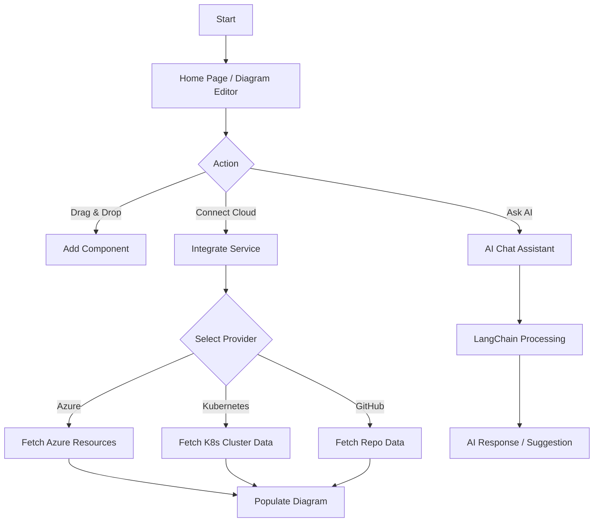
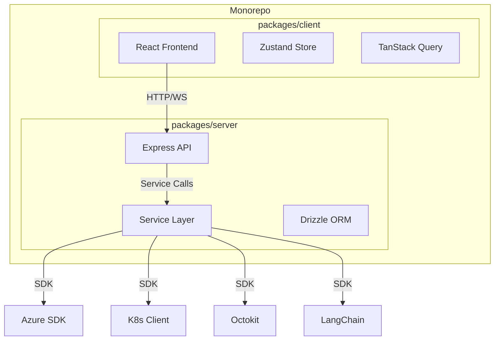

# Synapse Application Analysis

## Executive Summary
Synapse has evolved into a full-stack cloud architecture diagramming and management platform. It is now structured as a monorepo containing a React-based frontend and a robust Node.js/Express backend. The application not only allows users to draw diagrams but also integrates with major cloud providers (Azure, Oracle), container orchestration platforms (Kubernetes), and development tools (GitHub) to fetch real-time data and visualize infrastructure. It also features AI capabilities via LangChain.

## Functional Analysis

### Core Capabilities
*   **Visual Diagram Editor**: Interactive canvas for designing cloud architectures using drag-and-drop components.
*   **Multi-Cloud Support**: Native support for Azure, GCP, and Oracle Cloud components.
*   **Live Infrastructure Integration**:
    *   **Azure**: Fetch resources (VMs, Resource Groups) and metrics via Azure SDK.
    *   **Kubernetes**: Connect to clusters to visualize namespaces, pods, and services.
    *   **Oracle**: Integration with Oracle Cloud Infrastructure (OCI).
    *   **GitHub**: Integration for repository management and workflow visualization.
*   **AI Assistant**: Built-in AI chat capabilities powered by LangChain (supporting OpenAI, Anthropic, Google Gemini) to assist with architecture design and queries.
*   **Telemetry Mapping**: Service to map real-time telemetry data to diagram nodes.
*   **Custom Node Types**: Extensible system for defining custom component types with specific metadata.

### User Experience
*   **Interactive Interface**: Modern UI with smooth animations (Framer Motion), dark/light mode support, and responsive design.
*   **Real-time Feedback**: Integration with live services provides real-time status and metrics for infrastructure components.
*   **Mock Mode**: A "Mock Service" layer allows for development and testing without live cloud credentials.

### User Flow Diagram

## Technical Analysis

### Architecture
The project adopts a Monorepo structure using a `packages/` directory to separate concerns between the client and server.

### Tech Stack

#### Frontend (`packages/client`)
*   **Framework**: React 18 with Vite
*   **State Management**: Zustand, TanStack Query
*   **UI Library**: Radix UI, Tailwind CSS, Lucide React
*   **Diagramming**: React Flow
*   **Testing**: Jest, React Testing Library

#### Backend (`packages/server`)
*   **Runtime**: Node.js
*   **Framework**: Express
*   **Database**: PostgreSQL with Drizzle ORM
*   **AI/LLM**: LangChain (OpenAI, Anthropic, Google)
*   **Integrations**:
    *   `@azure/arm-*` (Azure Resource Management)
    *   `@kubernetes/client-node` (Kubernetes)
    *   `@octokit/rest` (GitHub)
*   **Testing**: Jest, Supertest

### Key Components

#### Server Services (`packages/server/services`)
*   **`ServiceFactory`**: A factory pattern implementation to switch between real and mock implementations of services based on configuration.
*   **`AzureService`**: Handles authentication and resource fetching from Azure.
*   **`KubernetesService`**: Manages K8s cluster connections and resource listing.
*   **`GitHubService`**: Interacts with GitHub API for repository data.
*   **`AIChatService`**: Orchestrates LLM interactions.

#### Client Features
*   **`TelemetryMapService`**: Maps backend data streams to frontend visual nodes.
*   **`NodeTypes`**: Enhanced to support dynamic fields driven by backend data types.

## Summary & Key Takeaways
*   **Significant Evolution**: The project has moved from a simple diagram editor to a sophisticated cloud management tool.
*   **Enterprise Ready**: The architecture supports modular service integration, making it suitable for enterprise environments with diverse infrastructure.
*   **AI-First**: Deep integration of AI agents suggests a focus on "intelligent" architecture design.
*   **Testability**: The inclusion of a comprehensive Mock Service layer ensures the application is robust and easy to develop against without needing live cloud environments.
