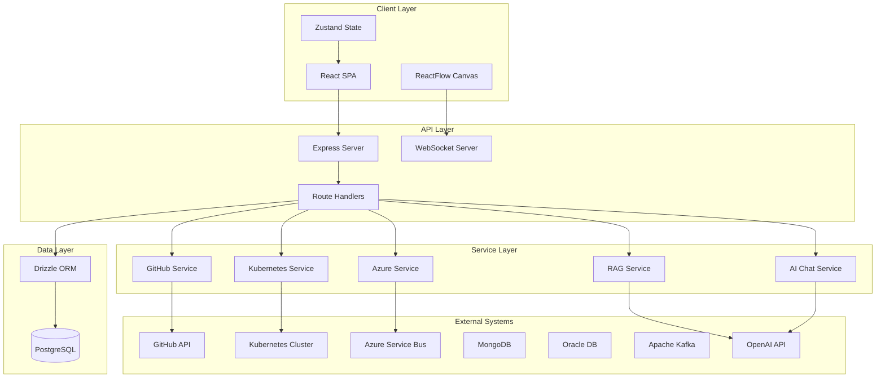
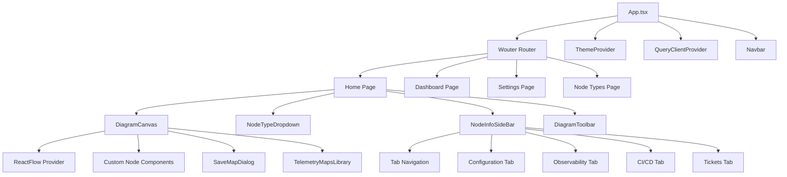
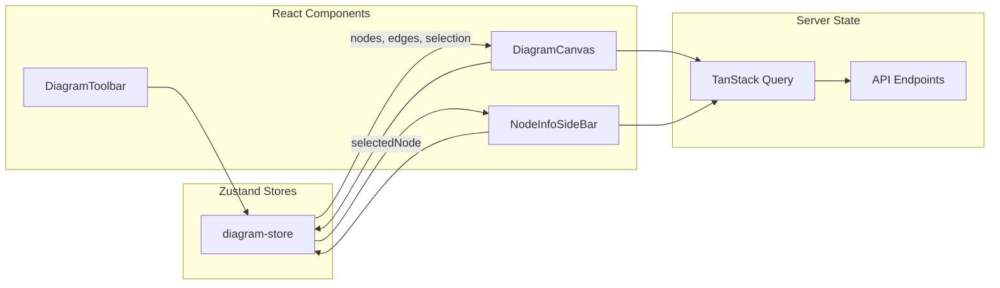
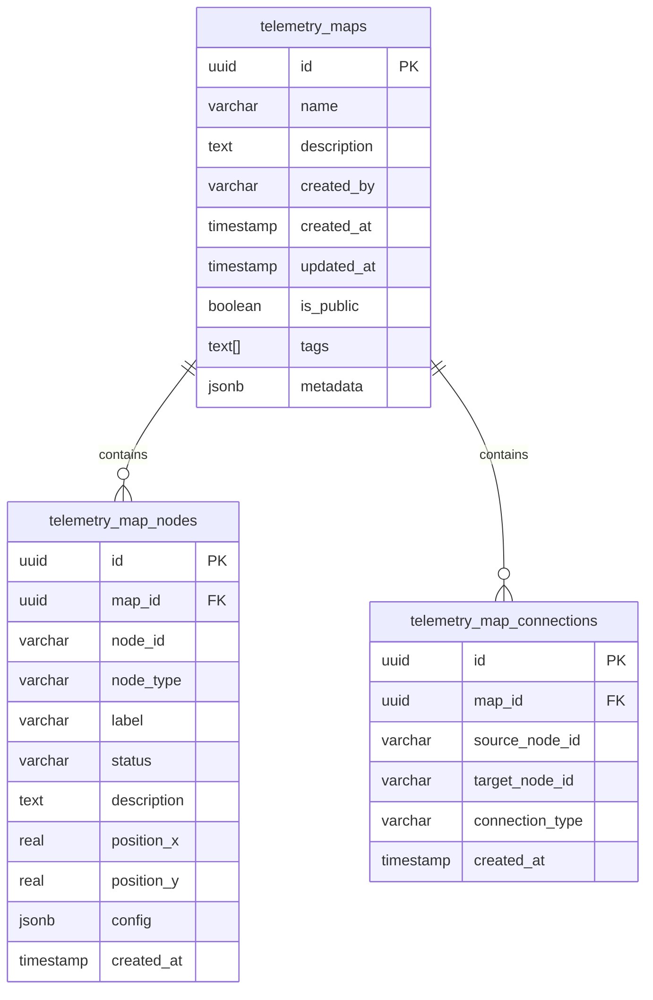
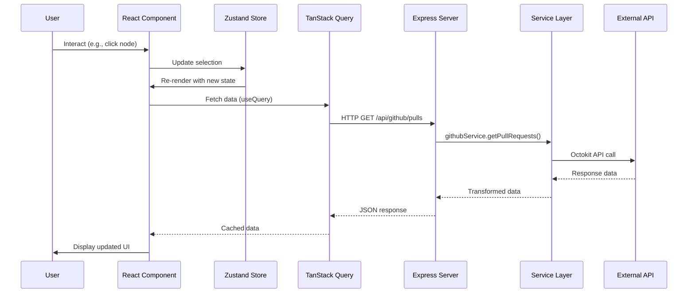
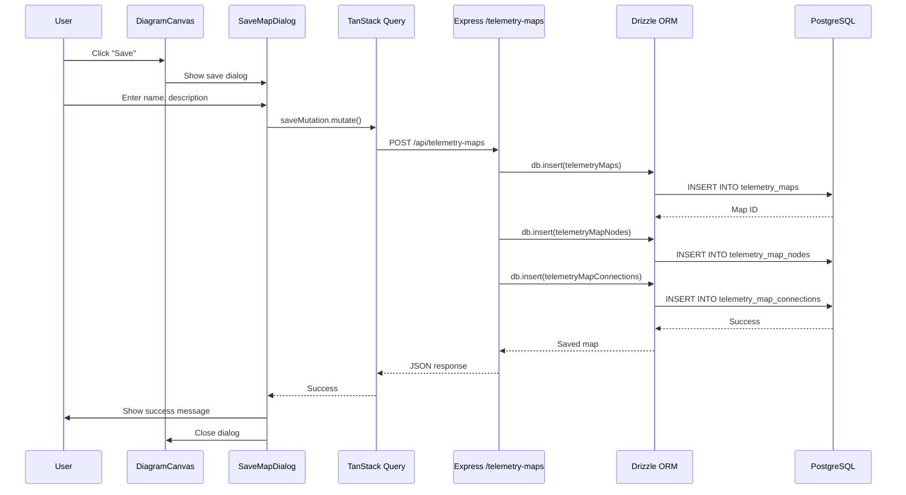
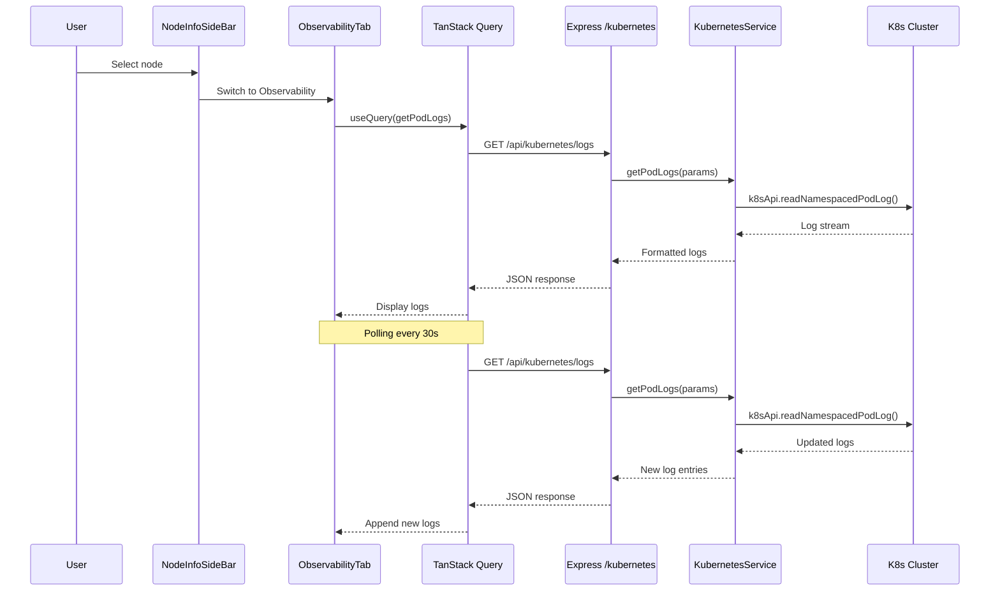
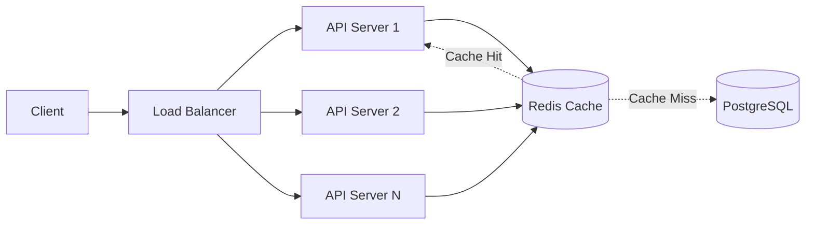

# Perceptacle Architecture Documentation

## System Overview

Perceptacle is architected as a modern, cloud-native monorepo application following a clear client-server separation pattern. The system enables interactive infrastructure diagram creation with real-time data integration from multiple cloud platforms and services.

### High-Level Architecture



## Application Layers

### 1. Presentation Layer (Client)

**Technology**: React 18 + TypeScript + Vite

The presentation layer is a single-page application (SPA) built with React and TypeScript, providing an interactive user interface for diagram creation and infrastructure monitoring.

#### Key Components:
- **Routing**: Wouter for lightweight client-side routing
- **State Management**: Zustand for global state with minimal boilerplate
- **Server State**: TanStack Query for API data fetching and caching
- **UI Components**: Radix UI primitives with custom styling
- **Diagram Engine**: ReactFlow for node-based interactive diagrams
- **Styling**: Tailwind CSS with theme support (light/dark mode)

#### Component Hierarchy:


#### State Management Architecture:


**Key Patterns**:
- **Unidirectional Data Flow**: State flows down from stores to components
- **Controlled Components**: Form inputs controlled by React state
- **Composition**: Small, focused components composed into larger features
- **Custom Hooks**: Reusable logic extracted into hooks (use-mobile, use-toast)

### 2. Business Logic Layer (Server Services)

**Technology**: Express + TypeScript + Native SDKs

The business logic layer encapsulates integration logic and business rules for interacting with external systems.

#### Service Architecture:
```mermaid
graph TB
    Routes[Route Handlers] --> Factory[Service Factory]
    
    Factory --> |getInstance| GitHub[GitHub Service]
    Factory --> |getInstance| K8s[Kubernetes Service]
    Factory --> |getInstance| Azure[Azure Service]
    Factory --> |getInstance| MongoDB[MongoDB Service]
    Factory --> |getInstance| Oracle[Oracle Service]
    Factory --> |getInstance| Kafka[Kafka Service]
    Factory --> |getInstance| RAG[RAG Service]
    Factory --> |getInstance| AI[AI Chat Service]
    Factory --> |getInstance| Agents[Agents Service]
    
    GitHub --> |Octokit| GitHubAPI[GitHub REST API]
    K8s --> |client-node| K8sAPI[Kubernetes API]
    Azure --> |@azure/service-bus| AzureSB[Azure Service Bus]
    RAG --> |OpenAI SDK| OpenAIAPI[OpenAI API]
    AI --> |OpenAI SDK| OpenAIAPI
    
    Factory -.-> |Mock Mode| Mocks[Mock Services]
```

**Service Design Patterns**:

1. **Factory Pattern**: `service-factory.ts` provides centralized service instantiation
   - Singleton instances for services
   - Environment-based mock/real service selection
   - Credential management and validation

2. **Repository Pattern**: Services abstract external API complexity
   - Consistent interface across different backends
   - Error handling and retry logic
   - Response transformation and normalization

3. **Strategy Pattern**: Mock services for development/testing
   - Same interface as real services
   - Deterministic test data generation
   - No external dependencies required

### 3. Data Access Layer

**Technology**: Drizzle ORM + PostgreSQL

The data access layer manages persistent storage of telemetry maps, nodes, and connections.

#### Database Schema:


**ORM Features Used**:
- Type-safe queries with full TypeScript inference
- Automatic migration generation
- Relational queries with joins
- Transaction support
- Connection pooling

### 4. API Layer (Routes)

**Technology**: Express Router

The API layer exposes RESTful endpoints for client communication.

#### API Routes:
```mermaid
graph LR
    Client[Client App] --> API[/api/*]
    
    API --> Azure[/api/azure/*]
    API --> K8s[/api/kubernetes/*]
    API --> GitHub[/api/github/*]
    API --> Oracle[/api/oracle/*]
    API --> Agents[/api/agents/*]
    API --> MongoDB[/api/mongodb/*]
    API --> RAG[/api/rag/*]
    API --> Maps[/api/telemetry-maps/*]
    API --> Kafka[/api/kafka/*]
    API --> Actions[/api/actions/http]
    
    Azure --> AzureService[Azure Service]
    K8s --> K8sService[Kubernetes Service]
    GitHub --> GitHubService[GitHub Service]
    Oracle --> OracleService[Oracle Service]
    MongoDB --> MongoDBService[MongoDB Service]
    RAG --> RAGService[RAG Service]
    Maps --> Database[(PostgreSQL)]
```

**Route Patterns**:
- RESTful resource naming
- Consistent error responses
- Request validation
- Async/await error handling
- CORS configuration for client access

## Key Design Patterns

### 1. Model-View-Controller (MVC) Pattern

While not strict MVC, the application follows a similar separation:
- **View**: React components (`packages/client/src/components`, `pages`)
- **Controller**: Express route handlers (`packages/server/routes`)
- **Model**: Drizzle schemas and service classes (`packages/server/db`, `services`)

### 2. Observer Pattern

Implemented through multiple mechanisms:
- **React Component Updates**: State changes trigger re-renders
- **Zustand Subscriptions**: Components subscribe to store slices
- **TanStack Query**: Automatic cache invalidation and refetching
- **WebSocket Events**: Real-time updates pushed from server

### 3. Factory Pattern

**Location**: `packages/server/services/service-factory.ts`

Centralizes service instantiation with:
- Singleton management
- Environment-based configuration
- Mock service injection for testing

```typescript
// Example usage
const githubService = ServiceFactory.getInstance().getGitHubService();
const k8sService = ServiceFactory.getInstance().getKubernetesService();
```

### 4. Composition Pattern

React components favor composition over inheritance:
- Small, single-responsibility components
- Props for configuration
- Children for content injection
- Higher-order component patterns avoided in favor of hooks

### 5. Repository Pattern

Services act as repositories for external data:
- Abstract API complexity
- Provide unified interface
- Handle error translation
- Manage credentials and connections

Example: `GitHubService` provides methods like:
```typescript
async getPullRequests(params: PullRequestParams): Promise<PullRequest[]>
async getWorkflowRuns(params: WorkflowRunParams): Promise<WorkflowRun[]>
async listIssues(params: IssueParams): Promise<Issue[]>
```

### 6. Adapter Pattern

Services adapt third-party SDKs to application needs:
- Octokit → GitHubService
- @kubernetes/client-node → KubernetesService
- @azure/service-bus → AzureService

## Data Flow

### Request/Response Flow



### Diagram Save Flow



### Real-time Metrics Flow



## External Integrations

### 1. GitHub Integration

**Purpose**: Monitor CI/CD pipelines, pull requests, and issues

**SDK**: @octokit/rest (Official GitHub REST API client)

**Capabilities**:
- List and filter pull requests
- Get workflow run status
- List repository branches
- Query issues with filters
- Create new issues

**Authentication**: Personal Access Token (PAT) via environment variables

**Rate Limiting**: GitHub API rate limits handled by Octokit

### 2. Kubernetes Integration

**Purpose**: Monitor cluster resources, pods, and services

**SDK**: @kubernetes/client-node (Official Kubernetes JavaScript client)

**Capabilities**:
- List pods, services, deployments
- Retrieve pod logs in real-time
- Get resource metrics
- Query cluster information
- Namespace management

**Authentication**: Kubeconfig file or in-cluster service account

**Connection**: Long-lived connection pool for efficiency

### 3. Azure Service Bus Integration

**Purpose**: Message queue monitoring and management

**SDK**: @azure/service-bus (Official Azure SDK)

**Capabilities**:
- Send messages to queues/topics
- Receive and process messages
- Monitor queue depth
- Manage subscriptions

**Authentication**: Connection string or managed identity

### 4. MongoDB Integration

**Purpose**: NoSQL database monitoring

**SDK**: mongodb (Official MongoDB Node.js driver)

**Capabilities**:
- List collections
- Execute queries
- Monitor connection stats
- Aggregate data

**Authentication**: Connection string with credentials

### 5. Oracle Database Integration

**Purpose**: Enterprise database monitoring

**SDK**: oracledb (Official Oracle Node.js driver)

**Capabilities**:
- Execute queries
- Monitor sessions
- Performance metrics

**Authentication**: Connection string with credentials

### 6. Apache Kafka Integration

**Purpose**: Event streaming platform monitoring

**SDK**: kafkajs (Community Kafka client)

**Capabilities**:
- List topics
- Send messages
- Consume messages
- Monitor consumer groups

**Authentication**: SASL/SSL configuration

### 7. OpenAI Integration (RAG Service)

**Purpose**: AI-powered query assistance and code analysis

**SDK**: openai (Official OpenAI Node.js SDK)

**Capabilities**:
- Natural language queries
- Code analysis and explanation
- Infrastructure recommendations
- Troubleshooting assistance

**Authentication**: API key via environment variables

**Features**:
- Retrieval Augmented Generation (RAG)
- Context-aware responses
- Multi-turn conversations

### 8. AI Chat Service

**Purpose**: Interactive AI assistant for diagram creation

**SDK**: openai (Official OpenAI Node.js SDK)

**Capabilities**:
- Diagram generation from descriptions
- Component recommendations
- Best practice suggestions

**Authentication**: API key via environment variables

## Error Handling and Logging Strategy

### Client-Side Error Handling

**Strategy**: Graceful degradation with user feedback

1. **API Errors**: 
   - TanStack Query handles retries automatically
   - Error boundaries catch component errors
   - Toast notifications for user-facing errors
   - Fallback UI for failed data loads

2. **Validation Errors**:
   - Zod schema validation before API calls
   - Form-level error messages
   - Input-level error states

3. **Network Errors**:
   - Automatic retry with exponential backoff
   - Offline detection and indicators
   - Cached data fallback when available

**Example Pattern**:
```typescript
const { data, error, isLoading } = useQuery({
  queryKey: ['pullRequests', owner, repo],
  queryFn: () => fetchPullRequests(owner, repo),
  retry: 3,
  retryDelay: (attemptIndex) => Math.min(1000 * 2 ** attemptIndex, 30000)
});

if (error) {
  toast({
    title: "Failed to load pull requests",
    description: error.message,
    variant: "destructive"
  });
}
```

### Server-Side Error Handling

**Strategy**: Consistent error responses with proper HTTP status codes

1. **Global Error Handler**:
   - Express error middleware catches all errors
   - Status code extraction from error objects
   - JSON error responses

2. **Service-Level Errors**:
   - Try-catch blocks around external API calls
   - Error transformation to standard format
   - Logging of errors for debugging

3. **Validation Errors**:
   - Request validation at route level
   - 400 Bad Request for invalid input
   - Detailed error messages

**Example Pattern**:
```typescript
app.use((err: any, _req: Request, res: Response, _next: NextFunction) => {
  const status = err.status || err.statusCode || 500;
  const message = err.message || "Internal Server Error";
  res.status(status).json({ message });
  throw err; // Re-throw for logging
});
```

### Logging Strategy

**Client Logging**:
- Console errors for development
- Minimal production logging
- User action tracking (optional analytics integration point)

**Server Logging**:
- Request/response logging middleware
- Execution time tracking
- JSON response payload logging (truncated)
- Error stack traces in development

**Log Format**:
```
HH:MM:SS AM/PM [source] METHOD /path STATUS in XXms :: {"response":"data"}
```

**Example**:
```
3:45:12 PM [express] GET /api/github/pulls 200 in 234ms :: {"data":[...]…
```

## Security Considerations

### 1. Authentication and Authorization

**Current Implementation**:
- API keys and tokens stored in environment variables
- No built-in user authentication (designed for internal use)
- Service-level authentication for external APIs

**Recommendations for Production**:
- Add OAuth2/OpenID Connect for user authentication
- Implement role-based access control (RBAC)
- Session management with secure cookies
- JWT tokens for API authentication

### 2. API Token Management

**Security Measures**:
- Tokens never committed to version control
- `.env.example` provides template without secrets
- Server-side token storage only
- Environment variable validation on startup

**Token Types**:
- GitHub Personal Access Token (PAT)
- OpenAI API Key
- Azure Connection Strings
- Kubernetes Kubeconfig
- Database credentials

### 3. CORS Configuration

**Implementation**:
```typescript
app.use(cors({
  origin: [
    process.env.CLIENT_URL || "http://localhost:5173",
    "http://localhost:5174"
  ],
  credentials: true
}));
```

**Security**: Restricted to specific client origins, not wildcard

### 4. Input Validation

**Measures**:
- Request parameter validation in routes
- Query parameter sanitization
- Zod schemas for type safety
- SQL injection prevention via ORM

### 5. Data Protection

**Database**:
- Parameterized queries via Drizzle ORM
- Connection encryption in production
- Password hashing (if user auth added)

**Network**:
- HTTPS in production (configured at reverse proxy level)
- Secure WebSocket connections (WSS)

### 6. Dependency Security

**Practices**:
- Regular dependency updates
- Automated vulnerability scanning
- Minimal dependency footprint
- Official SDKs from trusted sources

### 7. Rate Limiting

**Recommendations**:
- Add express-rate-limit middleware
- Per-endpoint rate limits
- IP-based throttling
- API key-based quotas

**Example** (not currently implemented):
```typescript
import rateLimit from 'express-rate-limit';

const limiter = rateLimit({
  windowMs: 15 * 60 * 1000, // 15 minutes
  max: 100 // limit each IP to 100 requests per windowMs
});

app.use('/api/', limiter);
```

## Scalability and Performance

### Client Performance

**Optimizations**:
1. **Code Splitting**: Vite automatic chunking
2. **Lazy Loading**: Route-based code splitting with React.lazy
3. **Memoization**: React.memo for expensive renders
4. **Virtual Scrolling**: For large lists (could be added)
5. **Debouncing**: User input debouncing in search/filter
6. **CSS Optimization**: Tailwind CSS purging unused styles

**Bundle Size Management**:
- Tree-shaking for unused code
- Dynamic imports for heavy features
- CDN for static assets in production

### Server Performance

**Optimizations**:
1. **Connection Pooling**: Database connection reuse
2. **Service Singletons**: Reuse SDK client instances
3. **Response Compression**: gzip/brotli (could be added)
4. **Caching**: Redis for API response caching (could be added)
5. **Pagination**: All list endpoints support pagination
6. **Streaming**: Large log files streamed, not loaded entirely

**Concurrency**:
- Express handles concurrent requests efficiently
- Async/await throughout prevents blocking
- Database connection pool size configurable

### Database Performance

**Schema Design**:
- Indexed foreign keys for joins
- Indexed frequently queried columns (created_by, is_public)
- JSONB for flexible metadata without schema changes
- Normalized structure with proper relations

**Query Optimization**:
- Drizzle ORM generates efficient SQL
- Eager loading with joins to avoid N+1 queries
- Pagination on all list queries
- Connection pooling for reuse

### Scalability Strategies

**Horizontal Scaling**:
- Stateless API server can run multiple instances
- Load balancer distributes traffic
- Shared PostgreSQL database
- Session store can move to Redis for distributed sessions

**Vertical Scaling**:
- Increase server resources (CPU, RAM)
- Database performance tuning
- Connection pool size adjustment

**Caching Strategy** (Recommended):


**Monitoring and Profiling**:
- Request timing logs
- Database query performance tracking
- Memory usage monitoring
- External API latency tracking

---

## Architecture Decision Records (ADRs)

### ADR-001: Monorepo Structure

**Context**: Need to manage client and server as separate but related applications

**Decision**: Use npm workspaces with packages/client and packages/server

**Rationale**:
- Shared TypeScript types between client and server
- Coordinated versioning and releases
- Single repository for related code
- Independent deployment possible

**Consequences**:
- Simplified dependency management
- Easier code sharing
- Some build complexity
- Larger repository size

### ADR-002: Zustand for State Management

**Context**: Need global state management for diagram editor

**Decision**: Use Zustand instead of Redux or Context API

**Rationale**:
- Minimal boilerplate compared to Redux
- Better performance than Context API
- TypeScript support out of the box
- Simple API easy to learn
- No provider wrapper needed

**Consequences**:
- Smaller bundle size
- Faster development
- Less enterprise adoption than Redux
- Migration path to Redux available if needed

### ADR-003: TanStack Query for Server State

**Context**: Need to manage API data fetching, caching, and synchronization

**Decision**: Use TanStack Query (React Query) for server state

**Rationale**:
- Automatic caching and refetching
- Background updates
- Optimistic updates support
- Pagination and infinite scroll support
- Reduces custom code for data fetching

**Consequences**:
- Better user experience with loading states
- Reduced network requests via caching
- Learning curve for developers
- Additional dependency

### ADR-004: Drizzle ORM over Prisma

**Context**: Need type-safe database access layer

**Decision**: Use Drizzle ORM instead of Prisma

**Rationale**:
- Lighter weight than Prisma
- SQL-like query builder more familiar to developers
- Better TypeScript inference
- No code generation step required
- Drizzle Studio for database GUI

**Consequences**:
- Excellent TypeScript support
- Smaller bundle size
- Less mature ecosystem than Prisma
- Fewer community resources

### ADR-005: Service Factory Pattern

**Context**: Multiple services need instantiation with shared configuration

**Decision**: Implement factory pattern for service management

**Rationale**:
- Centralized service lifecycle management
- Easy mock service injection for testing
- Singleton pattern for resource efficiency
- Environment-based configuration

**Consequences**:
- Single source of truth for services
- Testability improved
- Additional abstraction layer
- Potential singleton issues in tests

### ADR-006: Mock Services for Development

**Context**: External API dependencies block local development

**Decision**: Implement mock services with same interface as real services

**Rationale**:
- No external dependencies for basic development
- Faster development cycle
- Deterministic test data
- Offline development possible

**Consequences**:
- Doubled service code (real + mock)
- Must keep mocks in sync with real implementations
- Better developer experience
- Easier testing

---

**Document Version**: 1.0.0  
**Last Updated**: January 2026  
**Next Review**: Quarterly
