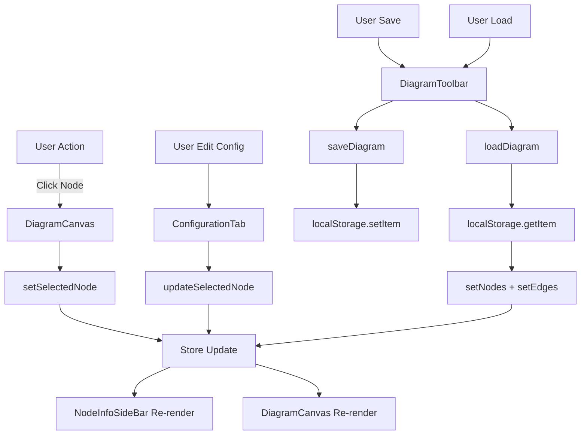

# diagram-store.ts

**Path**: `packages/client/src/utils/diagram-store.ts`

## Overview

Global state management store for the diagram editor using Zustand. Manages nodes, edges, selection state, and diagram persistence operations.

### Purpose
- Centralize diagram state (nodes, edges, selection)
- Provide actions for diagram manipulation
- Handle local storage persistence
- Manage node logs and updates
- Coordinate between ReactFlow and application state

### Dependencies
- `zustand` - Minimal state management library
- `reactflow` - Diagram library types (Node, Edge, ReactFlowInstance)

### Exports
- `useDiagramStore` - Zustand hook for accessing diagram state

---

## State Interface

### `DiagramState`

| Property | Type | Description |
|----------|------|-------------|
| `nodes` | `Node[]` | Array of all diagram nodes |
| `edges` | `Edge[]` | Array of all connections between nodes |
| `selectedNode` | `Node \| null` | Currently selected node (for configuration panel) |
| `rfInstance` | `ReactFlowInstance \| null` | ReactFlow instance reference |
| `ownerFilter` | `string \| null` | Filter nodes by owner (for multi-user scenarios) |

---

## Actions

### `setNodes(nodes: Node[])`
[Source](../../../../packages/client/src/utils/diagram-store.ts#L29)

**Description**:  
Replaces the entire nodes array. Used when loading diagrams or bulk updates.

**Parameters**:
- `nodes: Node[]` - New complete array of nodes

**Side Effects**:
- Overwrites all existing nodes
- Triggers re-render of DiagramCanvas

**Called By**:
- [`DiagramCanvas`](../components/DiagramCanvas.md) when loading maps
- [`loadDiagram`](#loaddiagram) when restoring from localStorage

---

### `setEdges(edges: Edge[])`
[Source](../../../../packages/client/src/utils/diagram-store.ts#L30)

**Description**:  
Replaces the entire edges array.

**Parameters**:
- `edges: Edge[]` - New complete array of edges

**Side Effects**:
- Overwrites all existing edges
- Triggers re-render of connections

**Called By**:
- [`DiagramCanvas`](../components/DiagramCanvas.md) on connection changes
- [`loadDiagram`](#loaddiagram) when restoring from localStorage

---

### `setSelectedNode(node: Node | null)`
[Source](../../../../packages/client/src/utils/diagram-store.ts#L31)

**Description**:  
Sets the currently selected node. Used to show/hide configuration panel.

**Parameters**:
- `node: Node | null` - Node to select, or null to deselect

**Side Effects**:
- Opens/closes NodeInfoSideBar
- Updates sidebar content

**Called By**:
- [`DiagramCanvas`](../components/DiagramCanvas.md) on node click
- [`NodeInfoSideBar`](../components/NodeInfoSideBar/NodeInfoSideBar.md) on close

---

### `setRfInstance(instance: ReactFlowInstance)`
[Source](../../../../packages/client/src/utils/diagram-store.ts#L32)

**Description**:  
Stores reference to ReactFlow instance for programmatic control.

**Parameters**:
- `instance: ReactFlowInstance` - ReactFlow instance from onInit callback

**Side Effects**:
- Enables saveDiagram and loadDiagram functionality

**Called By**:
- [`DiagramCanvas`](../components/DiagramCanvas.md) in ReactFlow onInit

**Example**:
```typescript
<ReactFlow
  onInit={(instance) => setRfInstance(instance)}
  // ...
/>
```

---

### `setOwnerFilter(filter: string | null)`
[Source](../../../../packages/client/src/utils/diagram-store.ts#L33)

**Description**:  
Sets filter to show only nodes owned by specific user.

**Parameters**:
- `filter: string | null` - Owner name to filter by, or null for all nodes

**Side Effects**:
- Filters visible nodes in diagram

**Called By**:
- Dashboard or Settings page (when implemented)

---

### `updateSelectedNode(node: Node)`
[Source](../../../../packages/client/src/utils/diagram-store.ts#L35-L53)

**Description**:  
Updates the currently selected node's data while preventing infinite update loops.

**Parameters**:
- `node: Node` - Updated node object with new data

**Returns**: `void`

**Side Effects**:
- Updates node in nodes array
- Updates selectedNode state
- Triggers re-render with new node data

**Error Cases**:
- Returns early if no node is selected
- Skips update if node data hasn't actually changed (prevents loops)

**Algorithm**:
1. Get current state (nodes, selectedNode)
2. Return early if no selection
3. Find existing node and compare JSON
4. Skip if no changes detected
5. Map over nodes array, replacing matching node
6. Update both nodes array and selectedNode

**Performance**: O(n) where n = number of nodes

**Called By**:
- [`ConfigurationTab`](../components/NodeInfoSideBar/ConfigurationTab.md) on field changes
- [`CustomFieldsSection`](../components/CustomFieldsSection.md) on custom field updates

**Example**:
```typescript
const updatedNode = {
  ...selectedNode,
  data: {
    ...selectedNode.data,
    label: 'New Label',
    status: 'warning'
  }
};
updateSelectedNode(updatedNode);
```

---

### `addNodeLog(nodeId, message, level)`
[Source](../../../../packages/client/src/utils/diagram-store.ts#L55-L77)

**Description**:  
Adds a log entry to a specific node's log array. Maintains last 100 logs.

**Parameters**:
- `nodeId: string` - ID of the node to add log to
- `message: string` - Log message content
- `level: 'info' | 'warning' | 'error'` - Log severity (default: 'info')

**Returns**: `void`

**Side Effects**:
- Adds log object to node.data.logs array
- Removes oldest log if > 100 entries (circular buffer)
- Triggers re-render to show new log

**Log Object Structure**:
```typescript
{
  timestamp: string; // ISO 8601 format
  message: string;
  level: 'info' | 'warning' | 'error';
}
```

**Performance**: O(n) where n = number of nodes

**Called By**:
- External monitoring services (Kubernetes, Azure, etc.)
- Mock log generator for testing

**Example**:
```typescript
addNodeLog('pod-123', 'Container restarted', 'warning');
addNodeLog('service-456', 'Health check failed', 'error');
```

---

### `saveDiagram()`
[Source](../../../../packages/client/src/utils/diagram-store.ts#L79-L85)

**Description**:  
Saves current diagram state to browser localStorage.

**Parameters**: None

**Returns**: `void`

**Side Effects**:
- Writes diagram to localStorage key 'gcp-diagram'
- Persists nodes, edges, and ReactFlow viewport

**Error Cases**:
- Returns early if rfInstance is null
- May fail silently if localStorage is full or unavailable

**Storage Format**:
```json
{
  "nodes": [...],
  "edges": [...],
  "viewport": { "x": 0, "y": 0, "zoom": 1 }
}
```

**Called By**:
- [`DiagramCanvas`](../components/DiagramCanvas.md) on save trigger
- Auto-save functionality (if implemented)

**Note**: This is a simple local save. For persistent server-side saves, use [`TelemetryMapService`](../services/telemetryMapService.md).

---

### `loadDiagram()`
[Source](../../../../packages/client/src/utils/diagram-store.ts#L87-L98)

**Description**:  
Loads diagram state from browser localStorage.

**Parameters**: None

**Returns**: `void`

**Side Effects**:
- Reads from localStorage key 'gcp-diagram'
- Updates ReactFlow nodes and edges
- Updates store state

**Error Cases**:
- Returns early if rfInstance is null
- Returns silently if no saved diagram exists
- May fail if localStorage data is corrupted

**Called By**:
- [`DiagramCanvas`](../components/DiagramCanvas.md) on load trigger
- Application initialization (if auto-load enabled)

---

### `clearDiagram()`
[Source](../../../../packages/client/src/utils/diagram-store.ts#L100-L106)

**Description**:  
Clears all nodes and edges from the diagram.

**Parameters**: None

**Returns**: `void`

**Side Effects**:
- Resets nodes to empty array
- Resets edges to empty array
- Clears selected node
- Canvas becomes empty

**Called By**:
- [`DiagramToolbar`](../components/DiagramCanvas/DiagramToolbar.md) on "New Diagram"
- Before loading a different diagram

---

## Usage Pattern

### Hook Usage
```typescript
import { useDiagramStore } from '@/utils/diagram-store';

function MyComponent() {
  // Select specific state slices (prevents unnecessary re-renders)
  const nodes = useDiagramStore((state) => state.nodes);
  const setNodes = useDiagramStore((state) => state.setNodes);
  const selectedNode = useDiagramStore((state) => state.selectedNode);
  
  // Use actions
  const handleAddNode = () => {
    const newNode = { id: '1', type: 'custom', data: {}, position: { x: 0, y: 0 } };
    setNodes([...nodes, newNode]);
  };
  
  return <div>{/* ... */}</div>;
}
```

### Performance Optimization
Zustand allows selective subscriptions to prevent unnecessary re-renders:

```typescript
// ✅ Good: Only re-renders when nodes change
const nodes = useDiagramStore((state) => state.nodes);

// ❌ Bad: Re-renders on ANY state change
const store = useDiagramStore();
const nodes = store.nodes;
```

---

## State Flow



---

## Related Files

- [DiagramCanvas.tsx](../components/DiagramCanvas/DiagramCanvas.md) - Main consumer of store
- [NodeInfoSideBar.tsx](../components/NodeInfoSideBar/NodeInfoSideBar.md) - Displays selected node
- [ConfigurationTab.tsx](../components/NodeInfoSideBar/ConfigurationTab.md) - Updates node data
- [DiagramToolbar.tsx](../components/DiagramCanvas/DiagramToolbar.md) - Save/load actions
- [telemetryMapService.ts](../services/telemetryMapService.md) - Server-side persistence

---

## Future Enhancements

1. **Undo/Redo**: Implement history stack for undo/redo functionality
2. **Persistence**: Add auto-save to server instead of just localStorage
3. **Real-time Sync**: WebSocket updates when other users modify diagrams
4. **Version Control**: Track diagram versions and changes
5. **Computed State**: Add derived state like node count, connection count

---

**File Type**: TypeScript  
**Lines of Code**: 107  
**State Properties**: 5  
**Actions**: 9  
**Last Updated**: January 2026
