# Flow Diagrams

This document contains sequence diagrams, state transitions, and component interaction flows for all major application workflows in Synapse.

## Table of Contents

1. [Diagram Creation Flow](#diagram-creation-flow)
2. [Map Loading Flow](#map-loading-flow)
3. [Node Configuration Flow](#node-configuration-flow)
4. [Metrics Retrieval Flow](#metrics-retrieval-flow)
5. [GitHub Integration Flow](#github-integration-flow)
6. [AI Chat Flow](#ai-chat-flow)
7. [Kubernetes Log Streaming Flow](#kubernetes-log-streaming-flow)
8. [Azure Service Bus Flow](#azure-service-bus-flow)
9. [Database Query Flow](#database-query-flow)
10. [WebSocket Communication Flow](#websocket-communication-flow)
11. [Error Handling Flow](#error-handling-flow)

---

## Diagram Creation Flow

**Description**: User creates a new infrastructure diagram from scratch by adding nodes and connections.

**Related Files**:
- [DiagramCanvas.tsx](./files/client/components/DiagramCanvas/DiagramCanvas.md)
- [diagram-store.ts](./files/client/utils/diagram-store.md)
- [DropDown.tsx](./files/client/components/NodeTypeDropdown/DropDown.md)

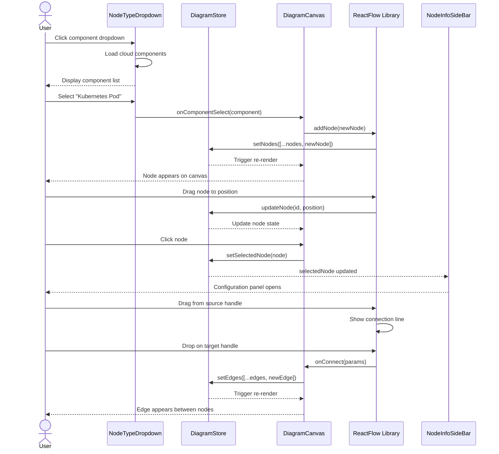
```mermaid
sequenceDiagram
    actor User
    participant Dropdown as NodeTypeDropdown
    participant Store as DiagramStore
    participant Canvas as DiagramCanvas
    participant ReactFlow as ReactFlow Library
    participant Sidebar as NodeInfoSideBar
    
    User->>Dropdown: Click component dropdown
    Dropdown->>Dropdown: Load cloud components
    Dropdown-->>User: Display component list
    
    User->>Dropdown: Select "Kubernetes Pod"
    Dropdown->>Canvas: onComponentSelect(component)
    Canvas->>ReactFlow: addNode(newNode)
    ReactFlow->>Store: setNodes([...nodes, newNode])
    Store-->>Canvas: Trigger re-render
    Canvas-->>User: Node appears on canvas
    
    User->>ReactFlow: Drag node to position
    ReactFlow->>Store: updateNode(id, position)
    Store-->>Canvas: Update node state
    
    User->>Canvas: Click node
    Canvas->>Store: setSelectedNode(node)
    Store-->>Sidebar: selectedNode updated
    Sidebar-->>User: Configuration panel opens
    
    User->>ReactFlow: Drag from source handle
    ReactFlow->>ReactFlow: Show connection line
    User->>ReactFlow: Drop on target handle
    ReactFlow->>Canvas: onConnect(params)
    Canvas->>Store: setEdges([...edges, newEdge])
    Store-->>Canvas: Trigger re-render
    Canvas-->>User: Edge appears between nodes
```

**States**:
- Initial: Empty canvas
- Adding: Component dropdown open, selection in progress
- Positioned: Node placed on canvas
- Connected: Edges created between nodes
- Configured: Node selected, sidebar open

---

## Map Loading Flow

**Description**: User loads a previously saved telemetry map from the database.

**Related Files**:
- [TelemetryMapsLibrary.tsx](./files/client/components/TelemetryMapsLibrary.md)
- [telemetryMapService.ts](./files/client/services/telemetryMapService.md)
- [telemetryMaps.ts](./files/server/routes/telemetryMaps.md)

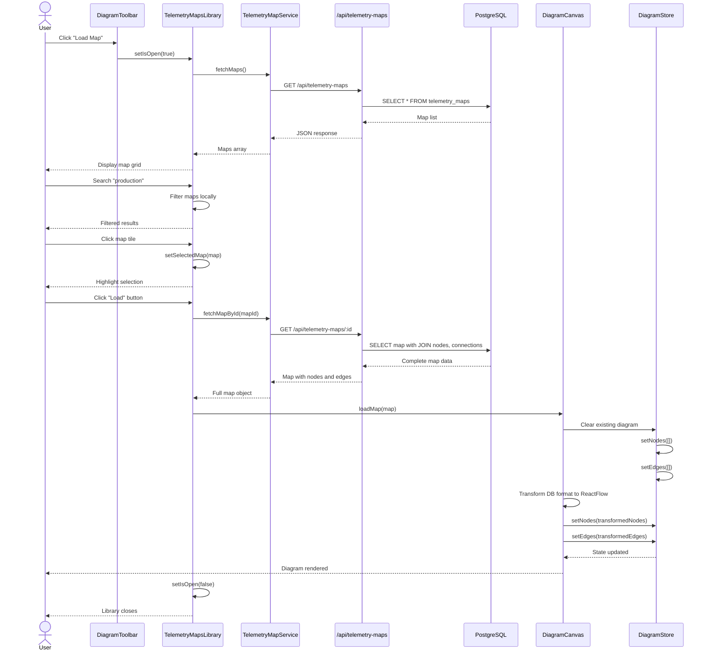
```mermaid
sequenceDiagram
    actor User
    participant Toolbar as DiagramToolbar
    participant Library as TelemetryMapsLibrary
    participant Service as TelemetryMapService
    participant API as /api/telemetry-maps
    participant DB as PostgreSQL
    participant Canvas as DiagramCanvas
    participant Store as DiagramStore
    
    User->>Toolbar: Click "Load Map"
    Toolbar->>Library: setIsOpen(true)
    Library->>Service: fetchMaps()
    Service->>API: GET /api/telemetry-maps
    API->>DB: SELECT * FROM telemetry_maps
    DB-->>API: Map list
    API-->>Service: JSON response
    Service-->>Library: Maps array
    Library-->>User: Display map grid
    
    User->>Library: Search "production"
    Library->>Library: Filter maps locally
    Library-->>User: Filtered results
    
    User->>Library: Click map tile
    Library->>Library: setSelectedMap(map)
    Library-->>User: Highlight selection
    
    User->>Library: Click "Load" button
    Library->>Service: fetchMapById(mapId)
    Service->>API: GET /api/telemetry-maps/:id
    API->>DB: SELECT map with JOIN nodes, connections
    DB-->>API: Complete map data
    API-->>Service: Map with nodes and edges
    Service-->>Library: Full map object
    
    Library->>Canvas: loadMap(map)
    Canvas->>Store: Clear existing diagram
    Store->>Store: setNodes([])
    Store->>Store: setEdges([])
    
    Canvas->>Canvas: Transform DB format to ReactFlow
    Canvas->>Store: setNodes(transformedNodes)
    Canvas->>Store: setEdges(transformedEdges)
    Store-->>Canvas: State updated
    Canvas-->>User: Diagram rendered
    
    Library->>Library: setIsOpen(false)
    Library-->>User: Library closes
```

**States**:
- Closed: Library not visible
- Loading: Fetching map list
- Browsing: Maps displayed, user searching/filtering
- Selected: User selected a map
- Loading Map: Fetching full map data
- Loaded: Map rendered on canvas
- Closed: Library dismissed

---

## Node Configuration Flow

**Description**: User configures a selected node's properties and custom fields.

**Related Files**:
- [NodeInfoSideBar.tsx](./files/client/components/NodeInfoSideBar/NodeInfoSideBar.md)
- [ConfigurationTab.tsx](./files/client/components/NodeInfoSideBar/ConfigurationTab.md)
- [CustomFieldsSection.tsx](./files/client/components/CustomFieldsSection.md)

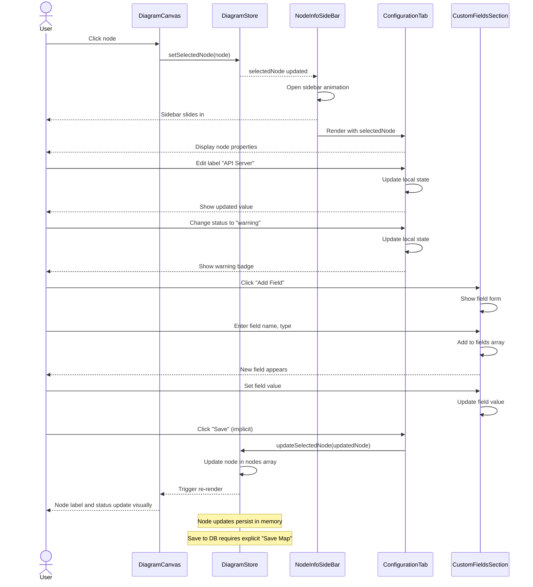
```mermaid
sequenceDiagram
    actor User
    participant Canvas as DiagramCanvas
    participant Store as DiagramStore
    participant Sidebar as NodeInfoSideBar
    participant ConfigTab as ConfigurationTab
    participant CustomFields as CustomFieldsSection
    
    User->>Canvas: Click node
    Canvas->>Store: setSelectedNode(node)
    Store-->>Sidebar: selectedNode updated
    Sidebar->>Sidebar: Open sidebar animation
    Sidebar-->>User: Sidebar slides in
    
    Sidebar->>ConfigTab: Render with selectedNode
    ConfigTab-->>User: Display node properties
    
    User->>ConfigTab: Edit label "API Server"
    ConfigTab->>ConfigTab: Update local state
    ConfigTab-->>User: Show updated value
    
    User->>ConfigTab: Change status to "warning"
    ConfigTab->>ConfigTab: Update local state
    ConfigTab-->>User: Show warning badge
    
    User->>CustomFields: Click "Add Field"
    CustomFields->>CustomFields: Show field form
    User->>CustomFields: Enter field name, type
    CustomFields->>CustomFields: Add to fields array
    CustomFields-->>User: New field appears
    
    User->>CustomFields: Set field value
    CustomFields->>CustomFields: Update field value
    
    User->>ConfigTab: Click "Save" (implicit)
    ConfigTab->>Store: updateSelectedNode(updatedNode)
    Store->>Store: Update node in nodes array
    Store-->>Canvas: Trigger re-render
    Canvas-->>User: Node label and status update visually
    
    Note over Store: Node updates persist in memory
    Note over Store: Save to DB requires explicit "Save Map"
```

**States**:
- No Selection: No node selected, sidebar closed
- Selected: Node selected, sidebar open, viewing config
- Editing: User actively changing field values
- Validating: Input validation in progress
- Updated: Changes applied to node state
- Saved: Changes persisted (after Save Map operation)

---

## Metrics Retrieval Flow

**Description**: Fetch and display real-time metrics for Kubernetes pods.

**Related Files**:
- [ObservabilityTab.tsx](./files/client/components/NodeInfoSideBar/ObservabilityTab.md)
- [kubernetes.ts](./files/server/routes/kubernetes.md)
- [kubernetes.ts](./files/server/services/kubernetes.md)

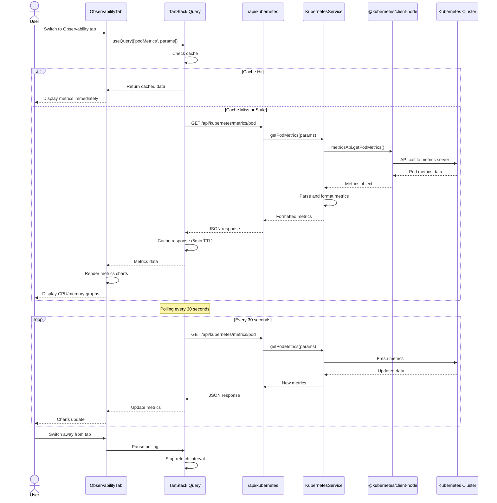
```mermaid
sequenceDiagram
    actor User
    participant Tab as ObservabilityTab
    participant Query as TanStack Query
    participant API as /api/kubernetes
    participant K8sService as KubernetesService
    participant K8sClient as @kubernetes/client-node
    participant Cluster as Kubernetes Cluster
    
    User->>Tab: Switch to Observability tab
    Tab->>Query: useQuery(['podMetrics', params])
    Query->>Query: Check cache
    
    alt Cache Hit
        Query-->>Tab: Return cached data
        Tab-->>User: Display metrics immediately
    else Cache Miss or Stale
        Query->>API: GET /api/kubernetes/metrics/pod
        API->>K8sService: getPodMetrics(params)
        K8sService->>K8sClient: metricsApi.getPodMetrics()
        K8sClient->>Cluster: API call to metrics server
        Cluster-->>K8sClient: Pod metrics data
        K8sClient-->>K8sService: Metrics object
        K8sService->>K8sService: Parse and format metrics
        K8sService-->>API: Formatted metrics
        API-->>Query: JSON response
        Query->>Query: Cache response (5min TTL)
        Query-->>Tab: Metrics data
        Tab->>Tab: Render metrics charts
        Tab-->>User: Display CPU/memory graphs
    end
    
    Note over Query: Polling every 30 seconds
    
    loop Every 30 seconds
        Query->>API: GET /api/kubernetes/metrics/pod
        API->>K8sService: getPodMetrics(params)
        K8sService->>Cluster: Fresh metrics
        Cluster-->>K8sService: Updated data
        K8sService-->>API: New metrics
        API-->>Query: JSON response
        Query-->>Tab: Update metrics
        Tab-->>User: Charts update
    end
    
    User->>Tab: Switch away from tab
    Tab->>Query: Pause polling
    Query->>Query: Stop refetch interval
```

**States**:
- Idle: Tab not active
- Loading: Initial metrics fetch
- Displaying: Metrics shown with charts
- Polling: Background updates every 30s
- Error: Failed to fetch metrics
- Paused: User switched tabs, polling stopped

---

## GitHub Integration Flow

**Description**: Fetch and display GitHub pull requests and workflow runs.

**Related Files**:
- [CICDTab.tsx](./files/client/components/NodeInfoSideBar/CICDTab.md)
- [github.ts](./files/server/routes/github.md)
- [github.ts](./files/server/services/github.md)

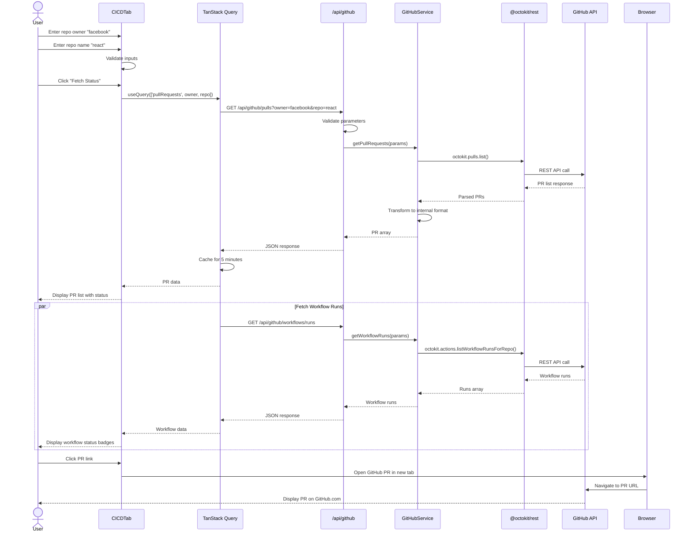
```mermaid
sequenceDiagram
    actor User
    participant Tab as CICDTab
    participant Query as TanStack Query
    participant API as /api/github
    participant GitHubService as GitHubService
    participant Octokit as @octokit/rest
    participant GitHub as GitHub API
    
    User->>Tab: Enter repo owner "facebook"
    User->>Tab: Enter repo name "react"
    Tab->>Tab: Validate inputs
    
    User->>Tab: Click "Fetch Status"
    Tab->>Query: useQuery(['pullRequests', owner, repo])
    Query->>API: GET /api/github/pulls?owner=facebook&repo=react
    API->>API: Validate parameters
    API->>GitHubService: getPullRequests(params)
    GitHubService->>Octokit: octokit.pulls.list()
    Octokit->>GitHub: REST API call
    GitHub-->>Octokit: PR list response
    Octokit-->>GitHubService: Parsed PRs
    GitHubService->>GitHubService: Transform to internal format
    GitHubService-->>API: PR array
    API-->>Query: JSON response
    Query->>Query: Cache for 5 minutes
    Query-->>Tab: PR data
    Tab-->>User: Display PR list with status
    
    par Fetch Workflow Runs
        Query->>API: GET /api/github/workflows/runs
        API->>GitHubService: getWorkflowRuns(params)
        GitHubService->>Octokit: octokit.actions.listWorkflowRunsForRepo()
        Octokit->>GitHub: REST API call
        GitHub-->>Octokit: Workflow runs
        Octokit-->>GitHubService: Runs array
        GitHubService-->>API: Workflow runs
        API-->>Query: JSON response
        Query-->>Tab: Workflow data
        Tab-->>User: Display workflow status badges
    end
    
    User->>Tab: Click PR link
    Tab->>Browser: Open GitHub PR in new tab
    Browser->>GitHub: Navigate to PR URL
    GitHub-->>User: Display PR on GitHub.com
```

**States**:
- Initial: No repository configured
- Configured: Owner and repo entered
- Fetching: API requests in progress
- Loaded: PRs and workflows displayed
- Error: Invalid repo or API error
- Refreshing: Background update in progress

---

## AI Chat Flow

**Description**: User interacts with RAG-powered AI assistant for troubleshooting.

**Related Files**:
- [rag.ts](./files/server/routes/rag.md)
- [rag.ts](./files/server/services/rag.md)
- [aichat.ts](./files/server/services/aichat.md)

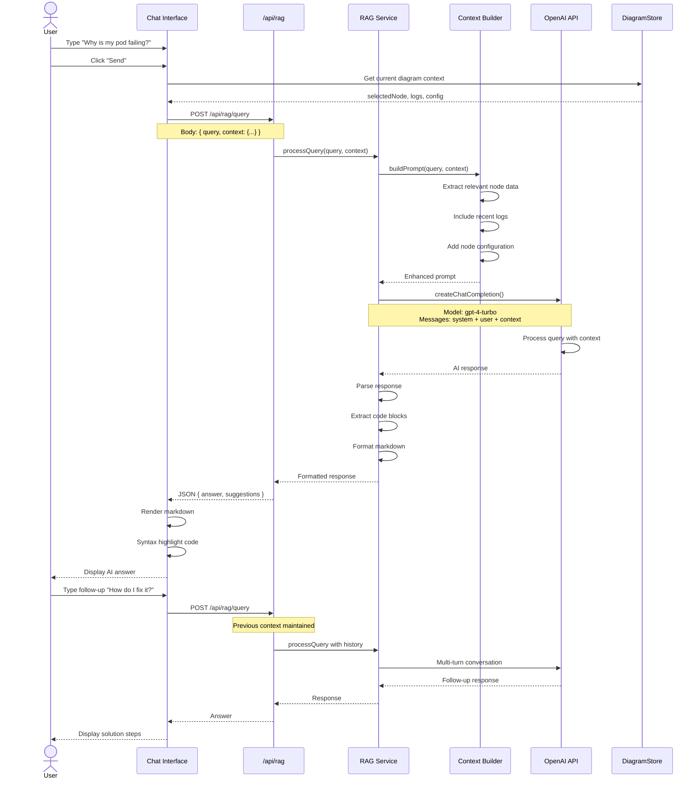
```mermaid
sequenceDiagram
    actor User
    participant UI as Chat Interface
    participant API as /api/rag
    participant RAGService as RAG Service
    participant Context as Context Builder
    participant OpenAI as OpenAI API
    participant Store as DiagramStore
    
    User->>UI: Type "Why is my pod failing?"
    User->>UI: Click "Send"
    
    UI->>Store: Get current diagram context
    Store-->>UI: selectedNode, logs, config
    
    UI->>API: POST /api/rag/query
    Note over UI,API: Body: { query, context: {...} }
    
    API->>RAGService: processQuery(query, context)
    RAGService->>Context: buildPrompt(query, context)
    Context->>Context: Extract relevant node data
    Context->>Context: Include recent logs
    Context->>Context: Add node configuration
    Context-->>RAGService: Enhanced prompt
    
    RAGService->>OpenAI: createChatCompletion()
    Note over RAGService,OpenAI: Model: gpt-4-turbo<br/>Messages: system + user + context
    
    OpenAI->>OpenAI: Process query with context
    OpenAI-->>RAGService: AI response
    
    RAGService->>RAGService: Parse response
    RAGService->>RAGService: Extract code blocks
    RAGService->>RAGService: Format markdown
    RAGService-->>API: Formatted response
    
    API-->>UI: JSON { answer, suggestions }
    UI->>UI: Render markdown
    UI->>UI: Syntax highlight code
    UI-->>User: Display AI answer
    
    User->>UI: Type follow-up "How do I fix it?"
    UI->>API: POST /api/rag/query
    Note over API: Previous context maintained
    API->>RAGService: processQuery with history
    RAGService->>OpenAI: Multi-turn conversation
    OpenAI-->>RAGService: Follow-up response
    RAGService-->>API: Response
    API-->>UI: Answer
    UI-->>User: Display solution steps
```

**States**:
- Idle: Chat interface open, awaiting input
- Typing: User composing query
- Submitting: Query sent to API
- Processing: AI generating response
- Streaming: Response being received (if streaming enabled)
- Displayed: Response shown to user
- Error: AI service unavailable or error

---

## Kubernetes Log Streaming Flow

**Description**: Stream real-time logs from a Kubernetes pod.

**Related Files**:
- [NodeLogs.tsx](./files/client/components/NodeInfoSideBar/NodeLogs.md)
- [kubernetes.ts](./files/server/routes/kubernetes.md)
- [kubernetes.ts](./files/server/services/kubernetes.md)

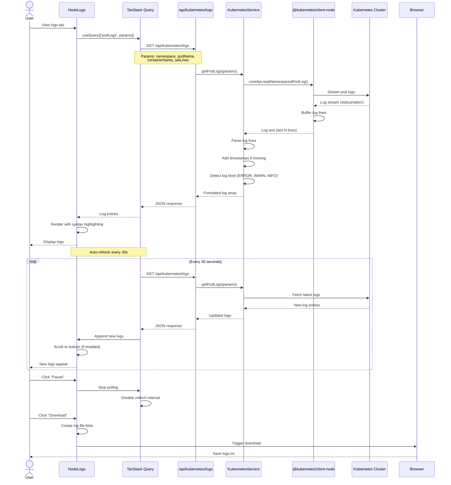
```mermaid
sequenceDiagram
    actor User
    participant LogsComponent as NodeLogs
    participant Query as TanStack Query
    participant API as /api/kubernetes/logs
    participant K8sService as KubernetesService
    participant K8sClient as @kubernetes/client-node
    participant Cluster as Kubernetes Cluster
    
    User->>LogsComponent: View logs tab
    LogsComponent->>Query: useQuery(['podLogs', params])
    
    Query->>API: GET /api/kubernetes/logs
    Note over Query,API: Params: namespace, podName,<br/>containerName, tailLines
    
    API->>K8sService: getPodLogs(params)
    K8sService->>K8sClient: coreApi.readNamespacedPodLog()
    K8sClient->>Cluster: Stream pod logs
    
    Cluster-->>K8sClient: Log stream (stdout/stderr)
    K8sClient->>K8sClient: Buffer log lines
    K8sClient-->>K8sService: Log text (last N lines)
    
    K8sService->>K8sService: Parse log lines
    K8sService->>K8sService: Add timestamps if missing
    K8sService->>K8sService: Detect log level (ERROR, WARN, INFO)
    K8sService-->>API: Formatted log array
    
    API-->>Query: JSON response
    Query-->>LogsComponent: Log entries
    LogsComponent->>LogsComponent: Render with syntax highlighting
    LogsComponent-->>User: Display logs
    
    Note over Query,LogsComponent: Auto-refresh every 30s
    
    loop Every 30 seconds
        Query->>API: GET /api/kubernetes/logs
        API->>K8sService: getPodLogs(params)
        K8sService->>Cluster: Fetch latest logs
        Cluster-->>K8sService: New log entries
        K8sService-->>API: Updated logs
        API-->>Query: JSON response
        Query->>LogsComponent: Append new logs
        LogsComponent->>LogsComponent: Scroll to bottom (if enabled)
        LogsComponent-->>User: New logs appear
    end
    
    User->>LogsComponent: Click "Pause"
    LogsComponent->>Query: Stop polling
    Query->>Query: Disable refetch interval
    
    User->>LogsComponent: Click "Download"
    LogsComponent->>LogsComponent: Create log file blob
    LogsComponent->>Browser: Trigger download
    Browser-->>User: Save logs.txt
```

**States**:
- Initial: No logs loaded
- Loading: First log fetch
- Streaming: Auto-refresh active
- Paused: User stopped auto-refresh
- Error: Failed to fetch logs (pod not found, auth error)

---

## Azure Service Bus Flow

**Description**: Send and receive messages via Azure Service Bus.

**Related Files**:
- [azure.ts](./files/server/routes/azure.md)
- [azure.ts](./files/server/services/azure.md)

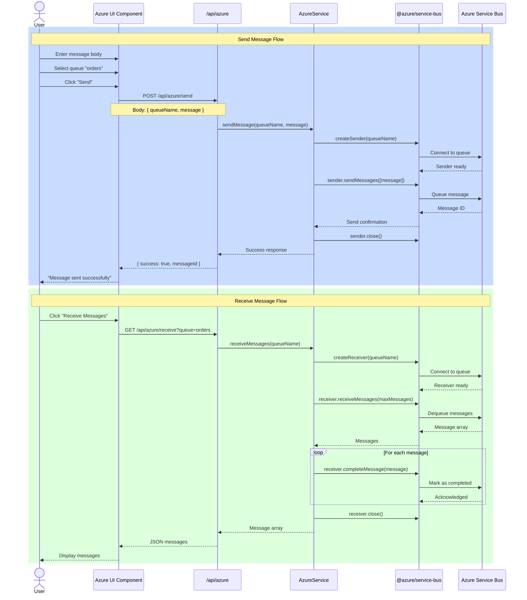
```mermaid
sequenceDiagram
    actor User
    participant UI as Azure UI Component
    participant API as /api/azure
    participant AzureService as AzureService
    participant ServiceBus as @azure/service-bus
    participant Azure as Azure Service Bus
    
    rect rgb(200, 220, 255)
        Note over User,Azure: Send Message Flow
        User->>UI: Enter message body
        User->>UI: Select queue "orders"
        User->>UI: Click "Send"
        
        UI->>API: POST /api/azure/send
        Note over UI,API: Body: { queueName, message }
        
        API->>AzureService: sendMessage(queueName, message)
        AzureService->>ServiceBus: createSender(queueName)
        ServiceBus->>Azure: Connect to queue
        Azure-->>ServiceBus: Sender ready
        
        AzureService->>ServiceBus: sender.sendMessages([message])
        ServiceBus->>Azure: Queue message
        Azure-->>ServiceBus: Message ID
        ServiceBus-->>AzureService: Send confirmation
        
        AzureService->>ServiceBus: sender.close()
        AzureService-->>API: Success response
        API-->>UI: { success: true, messageId }
        UI-->>User: "Message sent successfully"
    end
    
    rect rgb(220, 255, 220)
        Note over User,Azure: Receive Message Flow
        User->>UI: Click "Receive Messages"
        
        UI->>API: GET /api/azure/receive?queue=orders
        API->>AzureService: receiveMessages(queueName)
        AzureService->>ServiceBus: createReceiver(queueName)
        ServiceBus->>Azure: Connect to queue
        Azure-->>ServiceBus: Receiver ready
        
        AzureService->>ServiceBus: receiver.receiveMessages(maxMessages)
        ServiceBus->>Azure: Dequeue messages
        Azure-->>ServiceBus: Message array
        ServiceBus-->>AzureService: Messages
        
        loop For each message
            AzureService->>ServiceBus: receiver.completeMessage(message)
            ServiceBus->>Azure: Mark as completed
            Azure-->>ServiceBus: Acknowledged
        end
        
        AzureService->>ServiceBus: receiver.close()
        AzureService-->>API: Message array
        API-->>UI: JSON messages
        UI-->>User: Display messages
    end
```

**States**:
- Disconnected: No connection to Service Bus
- Connecting: Establishing connection
- Connected: Ready to send/receive
- Sending: Message being sent
- Sent: Message successfully queued
- Receiving: Fetching messages
- Received: Messages retrieved and displayed
- Error: Connection or operation failed

---

## Database Query Flow

**Description**: Execute custom database queries through the application.

**Related Files**:
- [oracle.ts](./files/server/routes/oracle.md)
- [mongodb.ts](./files/server/routes/mongodb.md)

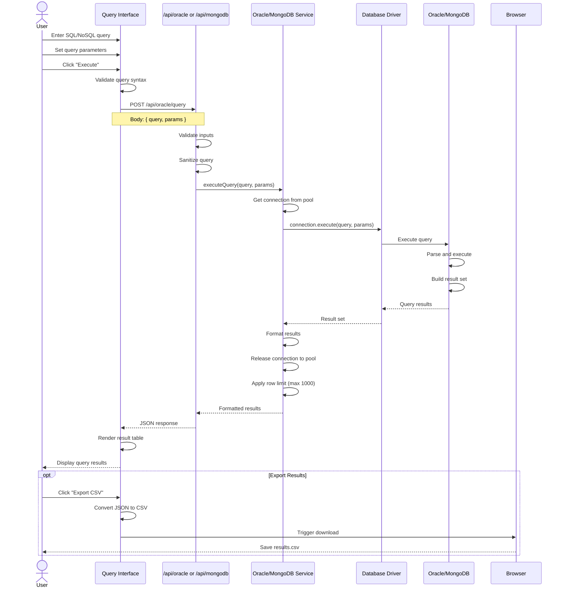
```mermaid
sequenceDiagram
    actor User
    participant UI as Query Interface
    participant API as /api/oracle or /api/mongodb
    participant Service as Oracle/MongoDB Service
    participant Driver as Database Driver
    participant Database as Oracle/MongoDB
    
    User->>UI: Enter SQL/NoSQL query
    User->>UI: Set query parameters
    User->>UI: Click "Execute"
    
    UI->>UI: Validate query syntax
    UI->>API: POST /api/oracle/query
    Note over UI,API: Body: { query, params }
    
    API->>API: Validate inputs
    API->>API: Sanitize query
    API->>Service: executeQuery(query, params)
    
    Service->>Service: Get connection from pool
    Service->>Driver: connection.execute(query, params)
    Driver->>Database: Execute query
    
    Database->>Database: Parse and execute
    Database->>Database: Build result set
    Database-->>Driver: Query results
    Driver-->>Service: Result set
    
    Service->>Service: Format results
    Service->>Service: Release connection to pool
    Service->>Service: Apply row limit (max 1000)
    Service-->>API: Formatted results
    
    API-->>UI: JSON response
    UI->>UI: Render result table
    UI-->>User: Display query results
    
    opt Export Results
        User->>UI: Click "Export CSV"
        UI->>UI: Convert JSON to CSV
        UI->>Browser: Trigger download
        Browser-->>User: Save results.csv
    end
```

**States**:
- Idle: Query input ready
- Validating: Syntax check
- Executing: Query running on database
- Success: Results returned
- Error: Syntax error, permission denied, or connection failure

---

## WebSocket Communication Flow

**Description**: Real-time updates via WebSocket connection (if implemented).

**Note**: WebSocket support is available via `ws` package but not fully implemented in current codebase. This diagram shows the intended design.

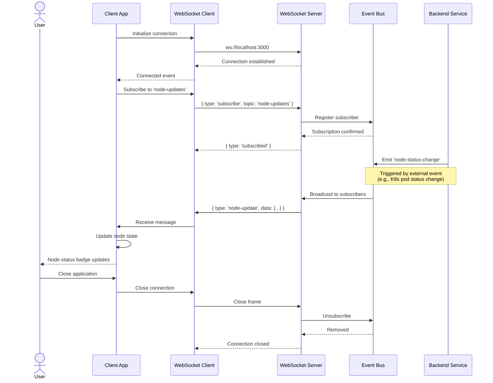
```mermaid
sequenceDiagram
    actor User
    participant Client as Client App
    participant WS as WebSocket Client
    participant WSServer as WebSocket Server
    participant EventBus as Event Bus
    participant Service as Backend Service
    
    Client->>WS: Initialize connection
    WS->>WSServer: ws://localhost:3000
    WSServer-->>WS: Connection established
    WS-->>Client: Connected event
    
    Client->>WS: Subscribe to 'node-updates'
    WS->>WSServer: { type: 'subscribe', topic: 'node-updates' }
    WSServer->>EventBus: Register subscriber
    EventBus-->>WSServer: Subscription confirmed
    WSServer-->>WS: { type: 'subscribed' }
    
    Service->>EventBus: Emit 'node-status-change'
    Note over Service,EventBus: Triggered by external event<br/>(e.g., K8s pod status change)
    
    EventBus->>WSServer: Broadcast to subscribers
    WSServer->>WS: { type: 'node-update', data: {...} }
    WS->>Client: Receive message
    Client->>Client: Update node state
    Client-->>User: Node status badge updates
    
    User->>Client: Close application
    Client->>WS: Close connection
    WS->>WSServer: Close frame
    WSServer->>EventBus: Unsubscribe
    EventBus-->>WSServer: Removed
    WSServer-->>WS: Connection closed
```

**States**:
- Disconnected: No WebSocket connection
- Connecting: Establishing connection
- Connected: Active WebSocket
- Subscribed: Listening to topics
- Receiving: Processing incoming messages
- Reconnecting: Connection lost, attempting reconnect
- Closed: Connection terminated

---

## Error Handling Flow

**Description**: How errors are caught, logged, and displayed to users.

**Related Files**:
- [index.ts](./files/server/index.md) (error middleware)
- [use-toast.ts](./files/client/hooks/use-toast.md)

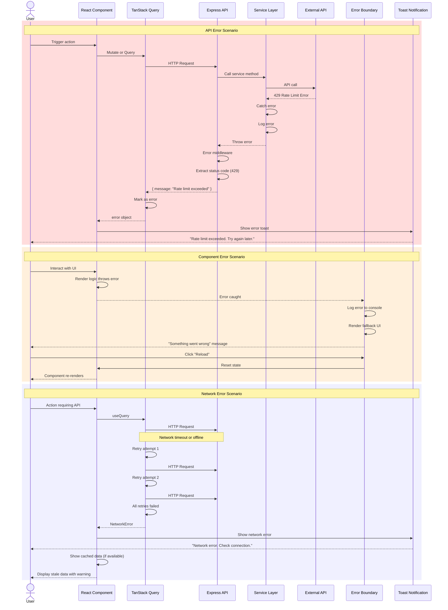
```mermaid
sequenceDiagram
    actor User
    participant Component as React Component
    participant Query as TanStack Query
    participant API as Express API
    participant Service as Service Layer
    participant External as External API
    participant ErrorBoundary as Error Boundary
    participant Toast as Toast Notification
    
    rect rgb(255, 220, 220)
        Note over User,Toast: API Error Scenario
        User->>Component: Trigger action
        Component->>Query: Mutate or Query
        Query->>API: HTTP Request
        API->>Service: Call service method
        Service->>External: API call
        External-->>Service: 429 Rate Limit Error
        Service->>Service: Catch error
        Service->>Service: Log error
        Service-->>API: Throw error
        API->>API: Error middleware
        API->>API: Extract status code (429)
        API-->>Query: { message: "Rate limit exceeded" }
        Query->>Query: Mark as error
        Query-->>Component: error object
        Component->>Toast: Show error toast
        Toast-->>User: "Rate limit exceeded. Try again later."
    end
    
    rect rgb(255, 240, 220)
        Note over User,Toast: Component Error Scenario
        User->>Component: Interact with UI
        Component->>Component: Render logic throws error
        Component-->>ErrorBoundary: Error caught
        ErrorBoundary->>ErrorBoundary: Log error to console
        ErrorBoundary->>ErrorBoundary: Render fallback UI
        ErrorBoundary-->>User: "Something went wrong" message
        User->>ErrorBoundary: Click "Reload"
        ErrorBoundary->>Component: Reset state
        Component-->>User: Component re-renders
    end
    
    rect rgb(240, 240, 255)
        Note over User,Toast: Network Error Scenario
        User->>Component: Action requiring API
        Component->>Query: useQuery
        Query->>API: HTTP Request
        Note over Query,API: Network timeout or offline
        Query->>Query: Retry attempt 1
        Query->>API: HTTP Request
        Query->>Query: Retry attempt 2
        Query->>API: HTTP Request
        Query->>Query: All retries failed
        Query-->>Component: NetworkError
        Component->>Toast: Show network error
        Toast-->>User: "Network error. Check connection."
        Component->>Component: Show cached data (if available)
        Component-->>User: Display stale data with warning
    end
```

**Error Types**:
1. **API Errors** (4xx, 5xx): Displayed via toast notifications
2. **Network Errors**: Retry logic with exponential backoff
3. **Validation Errors**: Inline form validation messages
4. **Component Errors**: Caught by error boundaries
5. **Auth Errors** (401, 403): Redirect or clear invalid credentials

**Error Logging**:
- Client: Console errors in development
- Server: Error middleware logs all errors
- External services: SDK-level error handling

---

## State Transition Diagram: Diagram Editor

**Description**: Overall state machine for the diagram editor.

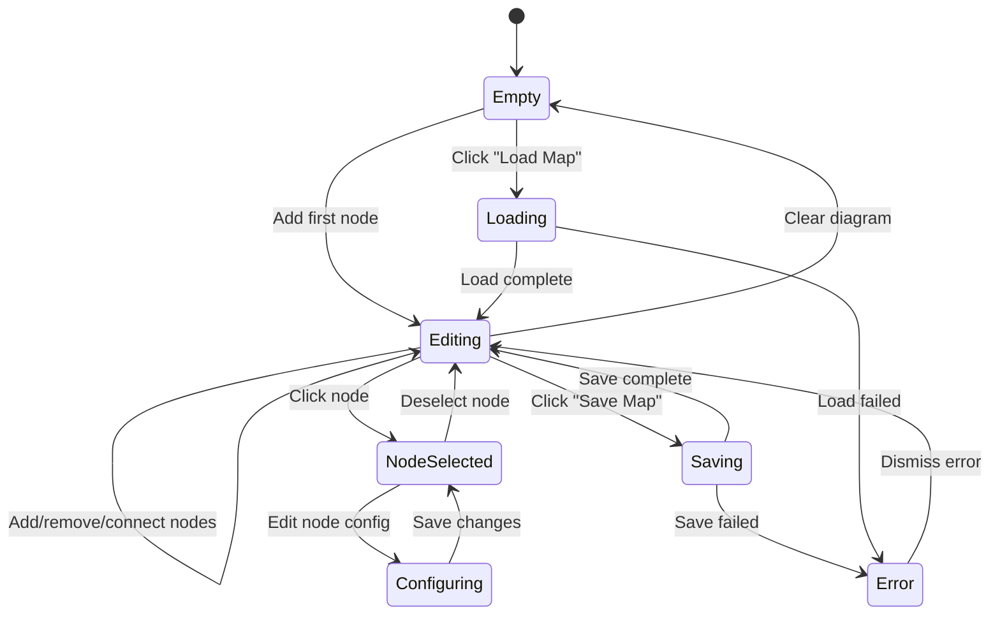
```mermaid
stateDiagram-v2
    [*] --> Empty
    Empty --> Editing : Add first node
    Editing --> Editing : Add/remove/connect nodes
    Editing --> NodeSelected : Click node
    NodeSelected --> Editing : Deselect node
    NodeSelected --> Configuring : Edit node config
    Configuring --> NodeSelected : Save changes
    Editing --> Saving : Click "Save Map"
    Saving --> Editing : Save complete
    Saving --> Error : Save failed
    Error --> Editing : Dismiss error
    Empty --> Loading : Click "Load Map"
    Loading --> Editing : Load complete
    Loading --> Error : Load failed
    Editing --> Empty : Clear diagram
```

**States**:
- **Empty**: No nodes on canvas
- **Editing**: User adding/modifying diagram
- **NodeSelected**: Single node selected
- **Configuring**: Editing node properties
- **Saving**: Persisting to database
- **Loading**: Fetching saved map
- **Error**: Operation failed

---

## Component Interaction Diagram

**Description**: How major components communicate.

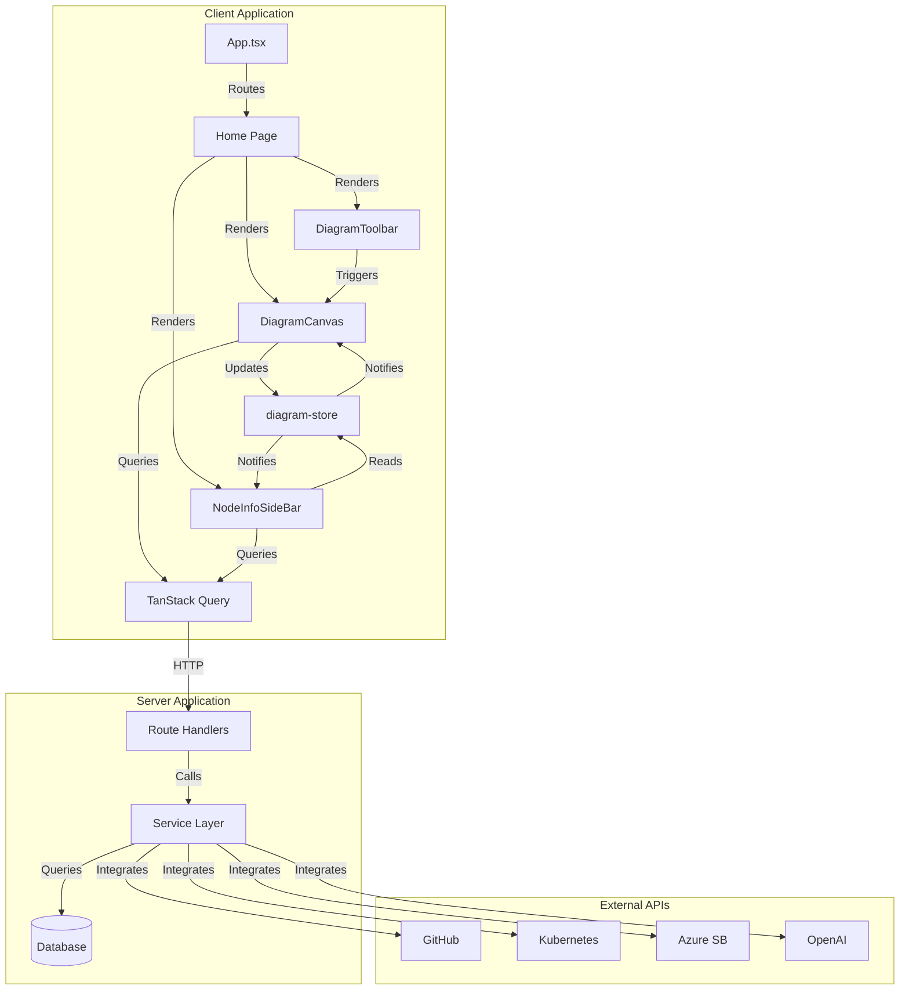
```mermaid
graph TB
    subgraph "Client Application"
        App[App.tsx]
        Home[Home Page]
        Canvas[DiagramCanvas]
        Sidebar[NodeInfoSideBar]
        Toolbar[DiagramToolbar]
        Store[diagram-store]
        Query[TanStack Query]
    end
    
    subgraph "Server Application"
        Routes[Route Handlers]
        Services[Service Layer]
        DB[(Database)]
    end
    
    subgraph "External APIs"
        GitHub[GitHub]
        K8s[Kubernetes]
        Azure[Azure SB]
        OpenAI[OpenAI]
    end
    
    App -->|Routes| Home
    Home -->|Renders| Canvas
    Home -->|Renders| Sidebar
    Home -->|Renders| Toolbar
    
    Canvas -->|Updates| Store
    Sidebar -->|Reads| Store
    Toolbar -->|Triggers| Canvas
    
    Canvas -->|Queries| Query
    Sidebar -->|Queries| Query
    Query -->|HTTP| Routes
    
    Routes -->|Calls| Services
    Services -->|Queries| DB
    Services -->|Integrates| GitHub
    Services -->|Integrates| K8s
    Services -->|Integrates| Azure
    Services -->|Integrates| OpenAI
    
    Store -->|Notifies| Canvas
    Store -->|Notifies| Sidebar
```

---

**Document Version**: 1.0.0  
**Last Updated**: January 2026  
**Related Documents**: [Architecture](./architecture.md), [Functional Overview](./functional-overview.md)
